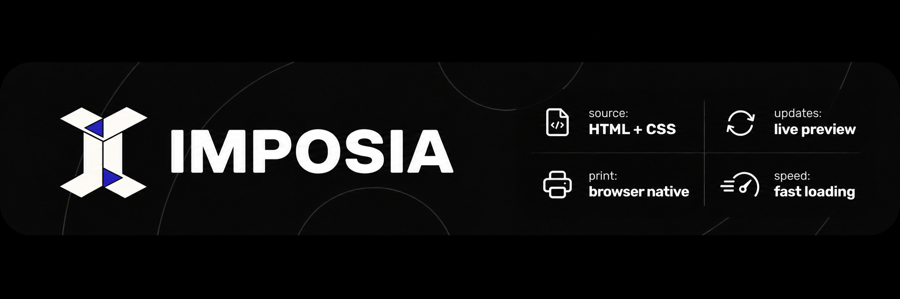

<p align="right">
  <a href="./README.md">English</a> |
  <strong>한국어</strong> |
  <a href="./README.ja.md">日本語</a> |
  <a href="./README.zh-CN.md">简体中文</a>
</p>



[](https://www.npmjs.com/package/@imposia/react)
[](https://github.com/EungyuCho/imposia/actions/workflows/verify.yml)
[](https://imposia.pages.dev/ko)
[](./LICENSE)

## 소개

Imposia는 HTML과 CSS를 브라우저에서 페이지로 나눕니다. 내용이 바뀌면 완성된
기존 미리보기를 보여주는 동안 다음 페이지를 준비합니다. 같은 페이지를 브라우저
인쇄 창에서 인쇄하거나 PDF로 저장할 수 있습니다.

## 시작하기

React 패키지를 설치하세요(React 18 이상).

```bash
pnpm add @imposia/react react react-dom
```

[시작 가이드](https://imposia.pages.dev/ko/docs/getting-started)에서 첫 페이지를
표시하는 방법을 확인하세요. Imposia는 브라우저에서 실행되며 PDF 저장에는 기본
인쇄 창을 사용합니다. PDF 바이트를 직접 반환하지는 않습니다.

## 주요 기능

- 기존 HTML과 CSS를 별도의 문서 렌더러 없이 페이지로 나눕니다.
- 내용이 바뀌면 완성된 기존 페이지를 유지하며 새 페이지를 준비합니다.
- 확정된 페이지를 미리보고 브라우저에서 인쇄하거나 PDF로 저장합니다.
- React Viewer 또는 프레임워크 중립적인 Core API를 사용합니다.

## 기여하기

변경을 제안하기 전에 [CONTRIBUTING.md](./CONTRIBUTING.md)를 읽어주세요.

## 문서

사용 가이드와 API 설명은 [문서 사이트](https://imposia.pages.dev/ko/docs)에
있습니다. [라이브 데모](https://imposia.pages.dev/examples/demo/index.html)도
체험해 보세요. 지원 레이아웃과 측정 방법은 [호환성 매트릭스](./docs/compatibility.md)와
[벤치마크](./docs/benchmarks.md)를 참고하세요.

## 라이선스

Imposia는 [Apache 2.0](./LICENSE) 라이선스를 따릅니다.
