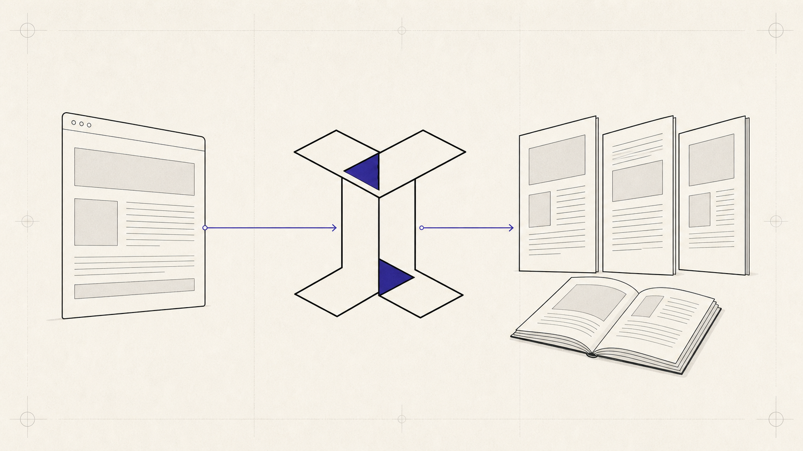

<p align="right">
  <a href="./README.md">English</a> |
  <a href="./README.ko.md">한국어</a> |
  <a href="./README.ja.md">日本語</a> |
  <strong>简体中文</strong>
</p>

<p align="center">
  <br/>
  
  <br/>
</p>

<p align="center">
  <strong>HTML in. Pages out.</strong>
  <br/>
  <sub>面向分页 HTML/CSS、React 预览、原生打印与可重排 EPUB 的浏览器原生出版工具包。</sub>
</p>

<p align="center">
  
  
  
  <a href="./LICENSE"></a>
</p>

<p align="center">
  <a href="https://imposia.pages.dev">文档</a> ·
  <a href="https://www.npmjs.com/org/imposia">npm 软件包</a> ·
  <a href="https://github.com/EungyuCho/imposia">GitHub</a>
</p>

<p align="center">
  <a href="#快速开始">快速开始</a> ·
  <a href="#为什么选择-imposia">为什么选择 Imposia</a> ·
  <a href="#工作原理">工作原理</a> ·
  <a href="#软件包">软件包</a> ·
  <a href="#发布契约">兼容性</a> ·
  <a href="#交互式演示">演示</a>
</p>

**无需引入第二套渲染运行时，即可将 HTML 与 CSS 转换为带分页、可检查的
浏览器文档。**

Imposia 是一个 React 优先、仅运行于浏览器的出版工具包。它负责清理源内容、
解析允许的资源，并在不作为展示依据的临时 iframe 中准备页面。只有
完全成功的结果才会提交到持续存在的单一 canonical iframe，供预览与浏览器原生打印
使用。最新提交的语义源还可以导出为可重排 EPUB 3.3 `Blob`。

Core 无需 React 即可使用。Imposia 不提供 Node 运行时、命令行渲染器、服务端
导出、固定版式 EPUB、PDF 字节 API，也不承诺完整的 CSS 分片兼容性。

<p align="center">
  
</p>

---

## 为什么选择 Imposia

当每个界面都维护不同的文档时，浏览器出版流程很容易发生偏差：编辑器测量
一棵树，预览复制另一棵树，打印又重建第三棵树。细微差异最终会变成页数不一致、
引用失效以及难以复现的输出。

Imposia 将一份页面文档放在整个工作流的中心。

| 出版问题 | 常见结果 | Imposia 的契约 |
| :--- | :--- | :--- |
| 预览与打印不一致 | 每个界面都会重新执行布局 | 同一个 canonical iframe 贯穿分页、展示和原生打印 |
| 编写的 URL 被隐式请求 | 渲染流程出现不受控的网络通道 | 所有允许的 HTML/CSS 资源都必须经过宿主 `assetResolver` 边界 |
| 不支持的布局看起来“差不多” | 静默近似掩盖错误输出 | 受限或不支持的情况保持原子性，或返回带类型的警告 |
| React 维护第二套渲染器 | 组件行为与框架无关行为产生偏差 | React 保留同一个 Core 控制器与 iframe |
| 导出依赖服务端管线 | 仅浏览器应用必须把内容交给另一套运行时 | 当前语义源可直接导出受限的可重排 EPUB `Blob` |

---

## 快速开始

安装 React 适配器：

```bash
pnpm add @imposia/react react react-dom
```

挂载页面文档，然后对当前已提交文档执行打印或 EPUB 导出：

```tsx
import {
  ImposiaPageViewer,
  type ImposiaPageViewerHandle,
} from "@imposia/react";
import { useRef } from "react";
import "@imposia/react/styles.css";

export function BookPreview() {
  const viewer = useRef<ImposiaPageViewerHandle>(null);

  return (
    <>
      <ImposiaPageViewer
        ref={viewer}
        source={{
          html: "<article><h1>Hello</h1><p>Browser-native pages.</p></article>",
        }}
        documentOptions={{ page: { size: "A4", margin: "18mm" } }}
        viewerOptions={{ mode: "spread", spread: { cover: true } }}
      />

      <button type="button" onClick={() => viewer.current?.setMode("single")}>
        单页阅读
      </button>

      <button type="button" onClick={() => void viewer.current?.print()}>
        Print
      </button>

      <button
        type="button"
        onClick={() =>
          void viewer.current?.exportEpub({
            metadata: {
              title: "Hello",
              language: "en",
              identifier: "urn:example:hello",
            },
          })
        }
      >
        Export EPUB
      </button>
    </>
  );
}
```

命令式句柄始终指向当前已提交的 Core 版本。它不会创建第二个控制器、iframe、
布局流程或资源请求通道。
`documentOptions` 在控制器挂载时固定。需要更换 resolver、extension、限制或页面
配置时，请递增 `documentOptionsRevision`，以使用新的 canonical iframe 重建控制器。
`source` 与 `sourceRevision` 更新仍会复用现有 iframe。

### 不使用 React，直接使用 Core

```bash
pnpm add @imposia/core
```

```ts
import { mountPageDocument } from "@imposia/core";

const controller = mountPageDocument(
  document.querySelector<HTMLElement>("#preview")!,
  {
    html: "<article><h1>Hello</h1><p>One canonical page DOM.</p></article>",
  },
  {
    page: { size: "A4", orientation: "portrait", margin: "18mm" },
  },
);

const pageDocument = await controller.ready;

console.log({
  pageCount: pageDocument.pageCount,
  pages: pageDocument.pages,
  warnings: pageDocument.warnings,
  timings: pageDocument.timings,
});
```

---

## 工作原理

Imposia 将源处理与展示分离，同时保持一份文档作为唯一事实来源。

```text
 HTML / CSS source
        │
        ├── discover assets ──► host assetResolver ──► Core-owned Blob URLs
        │
        ▼
 sanitize + normalize page media
        │
        ▼
 在不作为展示依据的临时 iframe 中分页
        │
        ▼
 将成功结果原子提交到持续存在的 canonical iframe
        │
        ├──► immutable page metadata + warnings + timings
        ├──► continuous / single-page / spread presentation
        └──► native browser print

 latest committed semantic source ──► bounded reflowable EPUB 3.3 Blob
```

| 阶段 | 处理内容 |
| :--- | :--- |
| **解析** | Imposia 发现 HTML 与 CSS 资源，并向宿主请求允许的字节。源内容中的 URL 不会变成 iframe 请求。 |
| **清理** | 标记、CSS、resolver 输出与 extension 输出始终位于 Core 的 CSP、限制和警告边界内。 |
| **分页** | 页面尺寸、支持的 `@page` 规则、分片、引用与出版内容在不作为展示依据的临时 iframe 中解析。 |
| **展示** | Viewer 与 React 保留持续存在的 canonical iframe，不复制页面，也不重新执行布局。 |
| **发布** | 原生打印直接作用于该 iframe；EPUB 导出则根据最近提交的语义源生成受限的可重排归档。 |

准备新版本时，上一次提交仍显示在持续存在的 canonical iframe 中。只有完全成功的
结果才会原子更新 iframe 内容并移除 staging iframe。失败、中止或被更新的任务取代时，
上一次提交保持不变。

---

## 软件包

四个浏览器 ESM 软件包从不同集成层公开同一套出版系统：

| 软件包 | 角色 | 适用场景 |
| :--- | :--- | :--- |
| [`@imposia/react`](https://www.npmjs.com/package/@imposia/react) | 主要 React 适配器 | React 18+ 应用需要组件、Hook 或命令式页面句柄 |
| [`@imposia/client`](https://www.npmjs.com/package/@imposia/client) | 统一的框架无关入口 | 希望通过一个浏览器依赖同时使用 Core 与 Viewer API |
| [`@imposia/core`](https://www.npmjs.com/package/@imposia/core) | canonical 页面文档运行时 | 不使用 React，直接控制生命周期、分页、resolver、extension、打印与 EPUB |
| [`@imposia/viewer`](https://www.npmjs.com/package/@imposia/viewer) | 页面与 PDF 展示 | 展示 Core iframe，或挂载独立的 PDF.js Canvas 查看器 |

软件包拆分只改变集成方式，不改变文档所有权。Core 始终是唯一事实来源。

---

## 有序 Publication 与 Reader 导航

当多个语义源需要共享一套阅读顺序、全局页序列、outline 与
EPUB spine 时，请使用 `ImposiaPublicationViewer`：

```tsx
import {
  ImposiaPublicationViewer,
  type ImposiaPublicationViewerHandle,
  type PublicationSnapshot,
} from "@imposia/react";
import { useRef } from "react";

const snapshot: PublicationSnapshot = {
  metadata: { title: "Field Notes", language: "zh-CN" },
  entries: [
    { id: "cover", title: "封面", html: "<h1>Field Notes</h1>" },
    { id: "chapter", title: "正文", html: "<h1>第一章</h1>" },
  ],
};

export function PublicationPreview() {
  const viewer = useRef<ImposiaPublicationViewerHandle>(null);

  return (
    <ImposiaPublicationViewer
      ref={viewer}
      snapshot={snapshot}
      viewerOptions={{ mode: "spread", spread: { cover: true }, inspector: true }}
    />
  );
}
```

内置 Reader 会把已提交 outline 展示为目录，并提供语义搜索与内容受限的
页面缩略图。React 句柄通过 `navigate()`、`search()`、`selectSearchResult()`、
`getThumbnails()` 与 `selectThumbnail()` 使用同一当前控制器路径。Inspector、
Contents、Search 与 Page thumbnails 位于 canonical iframe 之外，互斥显示并支持
键盘操作。

搜索结果与缩略图仅属于一个控制器及其已提交版本。替换后请重新解析或搜索；
保留的过期（stale）值会被拒绝。Reader UI 不会重新解析作者输入、栅格化页面、新增 iframe，
也不会再次分页。

---

## Canonical 页面文档

`PageDocument` 不只是一份渲染预览，它代表一个版本已提交的出版状态：

- 标准化的纸张与内容尺寸
- 不可变页面元数据、左右页、命名上下文和空白页标记
- 有序正文、装饰、警告与计时数据
- 用于展示与打印的隔离 canonical iframe
- 带边界的可重排 EPUB 导出方法

### 页面媒体与出版 CSS

稳定支持范围包括 A4、Letter、自定义绝对尺寸、纵向与横向、宿主边距、支持的
`@page` 选择器以及六个页边距框：

```css
@page {
  size: A4;
  margin: 18mm;

  @top-left {
    content: string(chapter);
  }

  @bottom-center {
    content: counter(page) " / " counter(pages);
  }
}

h1 {
  string-set: chapter content();
}
```

不支持的声明不会被静默伪装成等价的浏览器输出，而是生成诊断信息。

### 仅通过 Resolver 加载资源

宿主 `assetResolver` 是唯一允许的资源边界。Core 将批准的字节转换为自有 Blob
URL，并在替换、失败或销毁时释放。输入标记无法让隔离 iframe 直接请求其中
编写的 URL。

### 顺序确定的 Extension

Extension 可以转换字符串输入、过滤 resolver 请求并添加页面装饰。它们不接触
DOM 或网络，严格按声明顺序执行；也不能替换 resolver、放宽 CSP 或限制、绕过
生命周期回滚。

```ts
import { mountPageDocument, type PageExtension } from "@imposia/core";

const lastPageFooter: PageExtension = {
  name: "example/last-page-footer",
  decoratePage: ({ blank, number, totalPages }) =>
    blank || number !== totalPages
      ? undefined
      : { footerHtml: "完 · {{pageNumber}} / {{totalPages}}" },
};

const controller = mountPageDocument(host, source, {
  extensions: [lastPageFooter],
});
```

Publication extension 会逐项转换作者提供的 entry，并在 Core 添加受保护的
composition marker 之前运行：

```ts
import { mountPublication, type PublicationExtension } from "@imposia/core";

const entryPolicy: PublicationExtension = {
  name: "example/entry-policy",
  transformEntry(input, context) {
    if (input.entry.id === "appendix") {
      context.warn({
        code: "EXTENSION_APPENDIX_POLICY",
        message: "The appendix policy was applied.",
      });
    }
    return { html: `${input.html}<p>${input.publication.title}</p>` };
  },
};

const publication = mountPublication(host, snapshot, {
  extensions: [entryPolicy],
});
```

两种 extension 都只接收冻结值。输出会再次接受限制与清理；失败时保留已提交
generation。abort、supersession 或 destroy 会中止 `context.signal`，并执行通过
`context.onCleanup()` 注册的清理回调。

---

## 发布契约

Imposia 明确标注能力边界。相比无条件承诺浏览器到印刷的完全一致，一套较小且
可验证的能力子集更实用。

| 状态 | 包含的行为 |
| :--- | :--- |
| **Stable** | 浏览器 ESM API、canonical iframe 生命周期、resolver 隔离、页面尺寸、支持的 `@page` 选择器与页边距框、分页控制、原生打印、可重排 EPUB 导出 |
| **Constrained** | 行边界表格、column/no-wrap flex、单列 non-spanning grid、受限 multi-column 布局、本地 target reference 与 named string |
| **Experimental** | 可选的页面内脚注和顶部/底部 page float，并提供明确的 defer 与 fallback 警告 |
| **Unsupported** | Node 或 CLI 渲染、服务端导出、固定版式 EPUB、PDF 字节、任意 CSS 分片、跨浏览器页数完全一致 |

Chromium 是结构分页的参考实现。Firefox 与 WebKit 用于验证公开 API、隔离、
resolver 边界、生命周期、清理、原生打印调用与 EPUB 归档行为。测量结果与换行
位置可能不同。

在依赖受限或实验性能力前，请查阅权威的
[兼容性矩阵](./docs/compatibility.md)。

---

## 可重排 EPUB

`PageDocument.exportEpub()` 根据最新已提交语义源，返回
`application/epub+zip` 浏览器 `Blob`：

```ts
const epub = await pageDocument.exportEpub({
  metadata: {
    title: "The Browser Book",
    language: "en",
    identifier: "urn:example:browser-book",
  },
  limits: {
    maxEntries: 512,
    maxBytes: 16 * 1024 * 1024,
  },
});
```

导出仅允许当前保留的 resolver 资源，并执行元数据、条目数、字节数、中止与
生命周期限制。页面 wrapper、margin furniture、生成的页码 counter、Blob URL
以及仅页面使用的实验性产物不会进入归档。

这是语义化、可重排的 EPUB 3.3，而不是页面预览的固定版式快照。如需 PDF，
请调用 `print()` 并使用浏览器的“另存为 PDF”功能。

---

## Viewer 主题

Viewer 主题是由使用方拥有的 CSS 模块。先加载软件包样式，再在单个
`.imposia-viewer` 实例上覆盖公开变量：

```ts
import "@imposia/react/styles.css";
import "./viewer-theme.css";
```

```css
.imposia-viewer {
  --imposia-viewer-color-ink: #171522;
  --imposia-viewer-color-paper: #fff8e8;
  --imposia-viewer-color-accent: #4338ca;
  --imposia-viewer-font-serif: "Iowan Old Style", Georgia, serif;
}
```

用户可切换的主题也能按实例传入同一组 Token：

```ts
const viewer = mountPageViewer(host, pageDocument, {
  theme: {
    "--imposia-viewer-color-ink": "#171522",
    "--imposia-viewer-color-accent": "#8b6cff",
  },
});

viewer.setTheme({ "--imposia-viewer-color-accent": "#ef6a3b" });
```

主题只改变展示，不会新增 React 或 Core 生命周期。完整公开 Token 请参阅
[`@imposia/viewer` 主题契约](./packages/viewer/README.md#theme-modules)。

---

## 独立 PDF Viewer

`@imposia/viewer` 还包含连续页与单页 PDF.js Canvas 查看器。这是独立展示 API，
不是 Core 的 PDF 导出通道。

```ts
import { mountViewer } from "@imposia/viewer";
import "@imposia/viewer/styles.css";

const viewer = mountViewer(
  document.querySelector<HTMLElement>("#viewer")!,
  "/book.pdf",
  { workerSrc: "/pdf.worker.min.mjs" },
);

viewer.setMode("single");
viewer.setZoom(1.2);
viewer.nextPage();
```

展示 Core 页面文档时请使用 `mountPageViewer()`。它会保留该文档控制器创建的
原始 iframe。

---

## 交互式演示

[`examples/demo`](./examples/demo) 中的 React 出版实验室展示实时源更新、
标准化页面媒体、页边距框、有序 extension、受限出版案例、Viewer 控件、原生
打印与 EPUB 导出。

```bash
corepack pnpm install --frozen-lockfile
pnpm build
node scripts/serve-viewer.mjs
```

打开 `http://127.0.0.1:4178/examples/demo/`。

---

## 开发与验证

```bash
corepack pnpm install --frozen-lockfile
pnpm setup:browsers
pnpm check
```

`pnpm check` 会运行 preflight 验证、类型检查、lint、单元测试、软件包构建、
浏览器 E2E 测试、production 漏洞审计与依赖许可证审计。完整门禁和已保存产物映射位于
[`docs/verification.md`](./docs/verification.md)。

产品契约与架构决策可从 [`docs/routing.md`](./docs/routing.md) 查阅。当示例与
实现细节不一致时，请以兼容性矩阵为唯一事实来源。

## 贡献与发布

提交变更前，请阅读 [CONTRIBUTING.md](./CONTRIBUTING.md)，确认 clean-room 与真实
浏览器观测要求。面向维护者的发布顺序及 registry 前置条件见
[RELEASING.md](./RELEASING.md)，各版本的公开变更见 [CHANGELOG.md](./CHANGELOG.md)。
请通过 [SECURITY.md](./SECURITY.md) 中的私密渠道报告漏洞，并在社区交流中遵守
[Code of Conduct](./CODE_OF_CONDUCT.md)。

---

<p align="center">
  <em>为 Web 编写，并让同一份文档一直抵达纸张。</em>
  <br/><br/>
  <strong>Imposia</strong>
  <br/><br/>
  <a href="./LICENSE"><code>Apache-2.0</code></a>
</p>
